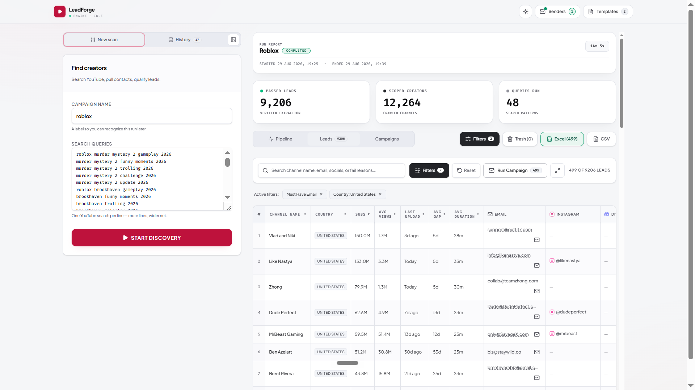
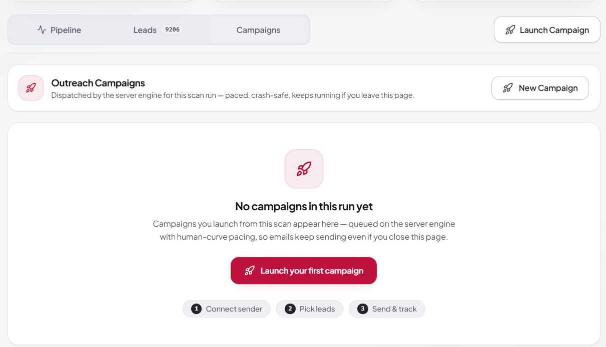

# LeadForge

**Local-first YouTube creator discovery & cold-email outreach for Windows.**

Search → Extract Contacts → Filter → Pitch Safely → Track — all from your own desktop.

*One-time purchase • No monthly fees • Your data never leaves your machine*

---

## What is LeadForge?

LeadForge is a **local-first desktop tool** for anyone who sells to YouTube creators — video editors, thumbnail designers, agencies, talent managers and lead-gen freelancers.

Type your search queries once, and LeadForge:

1. **Searches** YouTube deeply (channels **and** videos) across every query
2. **Collects** each matching channel's full profile and recent video stats
3. **Extracts** business emails and social links from bios, descriptions, Linktree pages and websites
4. **Filters** leads precisely — size, activity, content style, socials, country
5. **Pitches** them with personalized cold emails from **your own** Gmail / Outlook / SMTP mailbox
6. **Tracks** who has been pitched and who opened

No monthly SaaS bill. No shared sending pool. Your leads never leave your computer.

  

## Download

> [!IMPORTANT]
> Grab the latest portable build from the [**Releases page**](../../releases/latest) — or hit the direct link below.

**[⬇ Download LeadForge v1.0.16 (Portable, ~75 MB)](../../releases/latest/download/LeadForge-1.0.16-Portable.exe)**

- No installer — download, double-click, done.
- All settings and data live in a local `data/` folder next to the app and survive upgrades.
- The EXE is currently **unsigned**, so Chrome/SmartScreen may show a one-time warning — choose **More info → Run anyway**.

## Quick start

1. Download and run `LeadForge-1.0.16-Portable.exe`
2. Sign in with Google and activate your license key (48-hour offline grace — you're never locked out)
3. **New scan** → give it a name, paste one YouTube search query per line → **Start Discovery**
4. Watch the 5-stage pipeline fill your leads table live
5. **Filter** to exactly the creators you want → **Run Campaign** → connect a mailbox and launch

## Feature highlights

| Area | What you get |
|---|---|
| **Discovery engine** | Deep multi-query search (channels + videos tabs, up to 25 pages/query), de-duplication, 5 parallel stages with live progress, automatic junk filtering (zero-subs, Shorts-only, inactive) |
| **Contact extraction** | Business emails (even obfuscated `name [at] domain`), plus Instagram, Discord, Twitter/X, TikTok, LinkedIn, Facebook, Twitch, Linktree, Website |
| **Leads table** | 17 sortable columns, click-to-copy emails, full-text search, infinite scroll (smooth at 10k+ leads), fullscreen mode, per-lead pitch button with ✅ pitched badges |
| **8 filter types** | Subscribers, avg views, avg duration, last-upload recency, required socials, email status, country (with live counts), keyword — with a live match counter |
| **Outreach engine** | Campaigns from filtered leads, merge-tag personalization, human-curve pacing (jitter + warm-up + breaks), per-mailbox daily limits with rotation, retry/pause/resume, dispatch ledger |
| **InboxGuard** | Live spam-score (0–100) on every draft — flags trigger words, ALL-CAPS, link overload and more before you send |
| **Export** | 1-click Excel (.xlsx) / CSV of exactly what you see — filters and sorting included |
| **Tracking** | Self-hosted open-tracking pixel (no third party) and per-lead pitched badges |
| **Extras** | Chrome extension companion ("Extract Current Creator" on any YouTube tab), dark/light theme, mobile-ready layout, crash-safe run recovery |

  

## Safety by design

- **Rate-limit tough** — automatic backoff, retries, identity rotation and a 15-second watchdog keep long scans alive without hanging
- **Mailbox-safe sending** — 2.5s+ jitter between emails, first-5 warm-up, 20–60s rests every 8–14 sends, daily caps (default 490/day) and automatic mailbox rotation
- **Honest recovery** — app or machine restart mid-scan? The run is recovered and marked honestly; instant Stop keeps every lead found so far
- **Local-first storage** — runs, leads, ledgers, templates and mailbox credentials stay in your local `data/` folder. Nothing is uploaded to any cloud

## What LeadForge does *not* do

To set the right expectations: no AI-written emails, no follow-up sequences, no CRM/Sheets integrations, no cloud dashboard or team accounts, no email-list verification, no built-in proxies. One app, one machine, one user.

## Requirements

- Windows 10 or 11 (64-bit)
- ~200 MB free disk space
- An internet connection (for YouTube, your mailboxes and license sign-in)
- A Gmail / Outlook / custom SMTP mailbox to send from

## Changelog

See [CHANGELOG.md](CHANGELOG.md).

## License & support

LeadForge is distributed as a licensed product — one-time purchase, lifetime updates on the 1.x line. Redistribution of the binary is not permitted.

For support, contact the developer via the links on the [official landing page](https://leadforge-site-five.vercel.app/#trial).

---

LeadForge v1.0.16 — Search YouTube. Extract contacts. Filter leads. Pitch safely. Track results.

